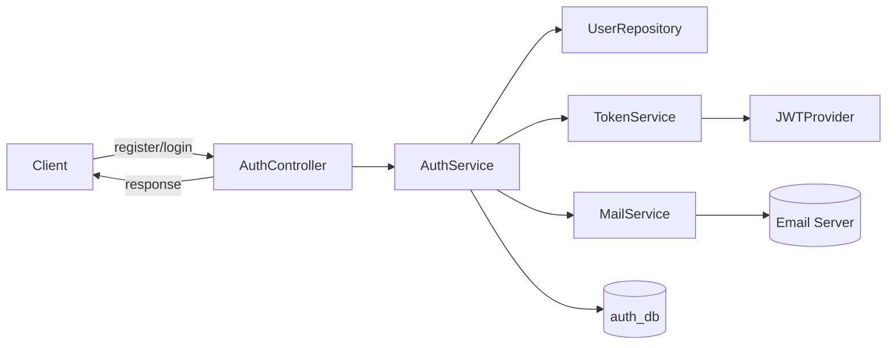

# 🧩 AUTH-SERVICE — Documentation

## 1. Overview

**Purpose:**
The `Auth Service` manages **user authentication and authorization** across the Smart Appointment Booking System. It handles **registration, login, email verification, token management**, and **password reset**.

It issues **JWT tokens** to secure communication and ensures only valid users can access protected endpoints.

---

## 2. Responsibilities

* User registration and email verification
* Secure login with JWT token generation
* Refresh token for session renewal
* Password reset (forgot/reset password flow)
* Account lockout and rate limiting (optional using Redis)
* Provide user details (`/me` endpoint) for profile context

---

## 3. Tech Stack

| Category             | Technology                  |
| -------------------- | --------------------------- |
| **Language**         | Java 21                     |
| **Framework**        | Spring Boot 3.3.x           |
| **Security**         | Spring Security (JWT-based) |
| **Database**         | PostgreSQL                  |
| **ORM**              | Spring Data JPA (Hibernate) |
| **Validation**       | Jakarta Bean Validation     |
| **Build Tool**       | Maven                       |
| **Mailing**          | Spring Boot Mail            |
| **Docs**             | SpringDoc / Swagger         |
| **Cache (Optional)** | Redis                       |
| **Testing**          | JUnit 5, Mockito            |

---

## 4. Architecture

### 4.1 High-Level Flow



### 4.2 Ports & URLs

| Service      | Port | Base URL       |
| ------------ | ---- | -------------- |
| Auth Service | 8081 | `/api/v1/auth` |

---

## 5. Database Design

### 5.1 Entities

#### 1️⃣ `User`

| Column               | Type                         | Description                  |
| -------------------- | ---------------------------- | ---------------------------- |
| `id`                 | UUID (PK)                    | Unique user ID               |
| `name`               | VARCHAR(255)                 | User’s full name             |
| `email`              | VARCHAR(255)                 | Unique email                 |
| `password`           | VARCHAR(255)                 | Encrypted password (BCrypt)  |
| `role`               | ENUM(ADMIN, DOCTOR, PATIENT) | Role-based access            |
| `enabled`            | BOOLEAN                      | Whether user verified email  |
| `verification_token` | VARCHAR(255)                 | Token for email verification |
| `reset_token`        | VARCHAR(255)                 | Token for password reset     |
| `created_at`         | TIMESTAMP                    | Creation time                |

---

## 6. Endpoints

| Method | Endpoint           | Description                | Auth Required     |
| ------ | ------------------ | -------------------------- | ----------------- |
| `POST` | `/register`        | Register new user          | ❌                 |
| `POST` | `/login`           | Login with email/password  | ❌                 |
| `POST` | `/verify-email`    | Verify email using token   | ❌                 |
| `POST` | `/refresh`         | Get new access token       | ✅ (Refresh token) |
| `POST` | `/forgot-password` | Send reset link to email   | ❌                 |
| `POST` | `/reset-password`  | Reset password using token | ❌                 |
| `GET`  | `/me`              | Get current user details   | ✅                 |

---

## 7. Detailed Endpoint Specs

---

### 🔹 **1. Register User**

**POST /api/v1/auth/register**

**Request:**

```json
{
  "name": "Dr. John Smith",
  "email": "john.smith@example.com",
  "password": "Password@123",
  "role": "DOCTOR"
}
```

**Response:**

```json
{
  "message": "User registered successfully. Please verify your email."
}
```

**Behavior:**

* Save user in DB with `enabled=false`
* Generate `verification_token`
* Send email with verification link:
  `https://app.com/verify?token=abc123`

---

### 🔹 **2. Verify Email**

**POST /api/v1/auth/verify-email**

**Request:**

```json
{
  "token": "abc123"
}
```

**Response:**

```json
{
  "message": "Account verified successfully!"
}
```

**Behavior:**

* Validate token
* Set `enabled=true`

---

### 🔹 **3. Login**

**POST /api/v1/auth/login**

**Request:**

```json
{
  "email": "john.smith@example.com",
  "password": "Password@123"
}
```

**Response:**

```json
{
  "accessToken": "eyJhbGciOiJIUzI1NiIsInR...",
  "refreshToken": "eyJhbGciOiJIUzI1NiIsInR...",
  "expiresIn": 3600
}
```

**Behavior:**

* Authenticate user using Spring Security
* Generate JWT & Refresh Token
* Return tokens

---

### 🔹 **4. Refresh Token**

**POST /api/v1/auth/refresh**

**Request:**

```json
{
  "refreshToken": "eyJhbGciOiJIUzI1NiIsInR..."
}
```

**Response:**

```json
{
  "accessToken": "newAccessToken",
  "expiresIn": 3600
}
```

---

### 🔹 **5. Forgot Password**

**POST /api/v1/auth/forgot-password**

**Request:**

```json
{
  "email": "john.smith@example.com"
}
```

**Response:**

```json
{
  "message": "Password reset link sent to your email."
}
```

**Behavior:**

* Generate reset token
* Send email with link
  `/reset-password?token=abc123`

---

### 🔹 **6. Reset Password**

**POST /api/v1/auth/reset-password**

**Request:**

```json
{
  "token": "abc123",
  "newPassword": "NewPassword@123"
}
```

**Response:**

```json
{
  "message": "Password reset successful."
}
```

---

### 🔹 **7. Get Current User**

**GET /api/v1/auth/me**

**Header:**

```
Authorization: Bearer <JWT_TOKEN>
```

**Response:**

```json
{
  "id": "0c21f8ef-32a4-4cc4-bf02-7aaab8a1328e",
  "name": "Dr. John Smith",
  "email": "john.smith@example.com",
  "role": "DOCTOR"
}
```

---

## 8. JWT Token Structure

JWT has two parts:

1. **Access Token** — expires in ~1 hour
2. **Refresh Token** — expires in ~7 days

**JWT Payload Example:**

```json
{
  "sub": "john.smith@example.com",
  "role": "DOCTOR",
  "iat": 1718000000,
  "exp": 1718003600
}
```

---

## 9. Exception Handling

Implemented using `@ControllerAdvice`.

Example structure:

```java
@RestControllerAdvice
public class GlobalExceptionHandler {

  @ExceptionHandler(UserAlreadyExistsException.class)
  public ResponseEntity<ApiError> handleUserExists(UserAlreadyExistsException ex) {
      return ResponseEntity.badRequest().body(new ApiError("USER_EXISTS", ex.getMessage()));
  }

  @ExceptionHandler(MethodArgumentNotValidException.class)
  public ResponseEntity<ApiError> handleValidation(MethodArgumentNotValidException ex) {
      return ResponseEntity.badRequest().body(new ApiError("VALIDATION_ERROR", "Invalid input"));
  }
}
```

---

## 10. Package Structure

```
auth-service/
└── src/main/java/com/smartappointment/auth
    ├── controller
    │   └── AuthController.java
    ├── service
    │   ├── AuthService.java
    │   └── TokenService.java
    ├── entity
    │   └── User.java
    ├── repository
    │   └── UserRepository.java
    ├── config
    │   ├── SecurityConfig.java
    │   ├── JwtFilter.java
    │   └── MailConfig.java
    ├── dto
    │   ├── RegisterRequest.java
    │   ├── LoginRequest.java
    │   ├── JwtResponse.java
    │   └── ResetPasswordRequest.java
    ├── exception
    │   └── GlobalExceptionHandler.java
    └── util
        ├── JwtUtil.java
        └── EmailUtil.java
```

---

## 11. Swagger Configuration

Add this dependency:

```xml
<dependency>
  <groupId>org.springdoc</groupId>
  <artifactId>springdoc-openapi-starter-webmvc-ui</artifactId>
  <version>2.5.0</version>
</dependency>
```

**Access Swagger UI:**

```
http://localhost:8081/swagger-ui/index.html
```

---

## 12. Security Configuration (JWT-based)

Example snippet:

```java
@Bean
SecurityFilterChain securityFilterChain(HttpSecurity http) throws Exception {
    return http
        .csrf(AbstractHttpConfigurer::disable)
        .authorizeHttpRequests(auth -> auth
            .requestMatchers("/api/v1/auth/**").permitAll()
            .anyRequest().authenticated()
        )
        .addFilterBefore(jwtFilter, UsernamePasswordAuthenticationFilter.class)
        .build();
}
```

---

## 13. Testing Strategy

| Test Type   | Framework        | Purpose                                |
| ----------- | ---------------- | -------------------------------------- |
| Unit Tests  | JUnit 5, Mockito | Service methods (AuthService, JwtUtil) |
| Integration | SpringBootTest   | DB + Controller layer                  |
| API Testing | Postman          | End-to-end flow                        |

---

## 14. Future Enhancements

* Redis for login throttling
* Multi-factor authentication
* OAuth2 (Google Login)
* Integration with API Gateway token validation

---

